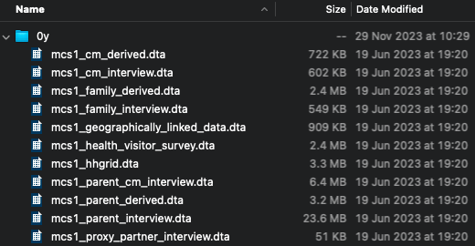

# Introduction

Once you have downloaded MCS data from the UK Data Service, you will notice that the data from a given sweep is split across multiple files (e.g., as in the below screenshot). The reason for this is that the MCS contains information on different observational units, for instance on the family, the cohort members' parents, and the cohort members themselves. The data are split across different files so that it can be stored efficiently. For instance, variables on the cohort members themselves are stored in files with one row per cohort member, and variables on parents are stored in files with one row per parent. The aim of this tutorial is to give you an overview of the data structures used by the MCS.

# Naming Conventions

The MCS data files use a consistent naming convention. Files are prefixed `mcsx`, with `x` being a number referring to a sweep (`mcs1`, `mcs2`, ..., `mcs7`). Next, the file name gives information on the level of the information it contains. Below are the main file names, though individual sweeps may have some additional files. The star (`*`) in these file paths is used as a wildcard. I'll give a brief overview here, but explain the structures in more detail below, including discussing the variables that you'll need to use to identify observations.

* `mcs[1-7]_family_*.dta`
  * Contains family-level information (one row per family).
* `mcs[1-7]_cm_*.dta`
  * Contains cohort-level information (one row per cohort member; some families have more than one cohort members [e.g., twins]).
* `mcs[1-7]_parent_*.dta`
  * Contains parent-level (or caregiver-level) information (one row per cohort member parent; most families have two parents, but this can change by sweep).
* `mcs[1-7]_parent_cm_interview.dta`
  * Contains cohort member-level information reported by individual parents (one row per cohort member x parent combination; a cohort member can be represented in two rows).
* `mcs[1-7]_hhgrid.dta`
  * Contains information on the household grid (one row per resident member of the household).

`mcs[1-7]_family_*.dta`, `mcs[1-7]_cm_*.dta`, and `mcs[1-7]_parent_*.dta` are typically split across two files each, one for raw responses and one for derived variables (e.g., `mcs1_cm_interview.dta` and `mcs1_cm_derived.dta`). Note, `mcs1_cm_interview.dta` does not mean the cohort member was interviewed themselves (parents were interviewed on their behalf for the first waves).

# `mcs[1-7]_family_*.dta`

Below is a schematic of the family-level files. We have one row per family and the family is uniquely identified by the `MCSID`. `MCSID` is a string variable that follows a standard but uninformative convention. The variable has the same name wherever it appear (i.e., it does not differ between sweeps). Below I show just three `MCSIDs`, which I'll be using these in the schematics for the other data structures.

| `MCSID` | ... |
|----------|----------|
| M10001A | ... |
| M10007B | ... |
| M10005C | ... |
| ... | ... |

# `mcs[1-7]_cm_*.dta`

The cohort member-level files have one row per cohort member. Cohort members are identified with two variables, `MCSID`, the family ID, and `[A-G]CNUM00`, the ID of the cohort member within the family.  The variable name for `[A-G]CNUM00` differs between sweep, with the first letter referring to sweep (e.g., `ACNUM00` for the first sweep, `GCNUM00` for the seventh sweep). While the variable name changes across sweeps, its value is persistent - a cohort member will have the same `[A-G]CNUM00` over time.

| `MCSID` | `[A-G]CNUM00` | ... |
|----------|----------|----------|
| M10001A | 1 (1st Cohort Member of the Family) | ... |
| M10001A | 2 (2nd Cohort Member of the Family) | ... |
| M10007B | 1 (1st Cohort Member of the Family) | ... |
| M10005C | 1 (1st Cohort Member of the Family) | ... |
| ... | ... | ... |

On its own, `[A-G]CNUM00` is not a unique identifier. Its value is one, two, or three for every cohort member. A singleton will be one, a twin could be one or two, and a triplet one, two, or three. Both `MCSID` and `[A-G]CNUM00` are required to uniquely identify a cohort member. 

Because two variables are required to uniquely identify a cohort member (one of which is not consistently named across files), you may prefer to create your own unique identifier to make merging more straightforward. Code to do this is provided on this website (`MCS -> Creating Identifiers`).

# `mcs[1-7]_parent_*.dta`

The parent files have a similar structure to the cohort member-level files: one row per parent. Individual parents are identified with two variables, `MCSID` and `[A-G]PNUM00`. `[A-G]PNUM00` is the ID of the person within the family. Below we have records for two parents in the `M10001A` family. The first parent is number one, the second parent is number three.

| `MCSID` | `[A-G]PNUM00` | ... |
|----------|----------|----------|
| M10001A | 1 | ... |
| M10001A | 3 | ... |
| M10007B | 1 | ... |
| M10007B | 2 | ... |
| M10005C | 1 | ... |
| ... | ... | ... |

Like `[A-G]CNUM00`, `[A-G]PNUM00` on its own is not a unique identifier. It lists the person number within the family, so it has to be combined with `MCSID` to identify a particular individual. Again, like `[A-G]CNUM00`, `[A-G]PNUM00` has a sweep-specific prefix, but it take the same value across sweeps for a given individual (i.e., it is persistent).

The value of `[A-G]PNUM00` is partly arbitrary. It does not specify a particular relationship to a cohort member. Such relationships are determined in the household grid files, which I discuss further below. The `[A-G]PNUM00` does follow a convention, however. For non-cohort members, PNUM is a positive integer between 1 and 99. For cohort members themselves, `[A-G]PNUM00` is equal to `[A-G]CNUM00` multiplied by 100; i.e. for the first cohort member in a family it is 100, and for the second it is 200. While cohort members have a `[A-G]PNUM00`, non-cohort members (parents or other household members) do not get a `[A-G]CNUM00`. 

Again, as two variables are required to uniquely identify a parent, code to create single unique identifier variables is provided at `MCS -> Creating Identifiers`.

Note, Sweeps 2 and 3 also contain a `mcs[2-3]_older_siblings_questionnaire.dta` file. These files are structured similarly to `mcs[1-7]_parent_*.dta` - there is one row per sibling. These are identified with `MCSID` and `BHPNUM00` or `MCSID` and `COPNUM00`. 

# `mcs[1-7]_parent_cm_interview.dta`

The `mcs[1-7]_parent_cm_interview.dta` files record information from individual parents about individual cohort members, typically on the relationship between the two. For instance, in the first sweep, the file contains information reported by each parent on whether they have ever lived apart from a specific cohort member. 

As the MCS contains some twin and triplet families, each parent may report on multiple cohort members. As each parent is interviewed - or is attempted to be interviewed - each child may be reported on by multiple parents. For instance, below for the family `M1001A`, we have two parents (`[A-G]PNUM00` 1 and 3) who each report on two children (`[A-G]CNUM00` 1 and 2). Therefore, we have four rows for this family, one per parent x cohort member combination. For the other families, we have fewer rows, either because the family only contains one cohort member (as for the family `M1007B`) or the interview was only completed by one parent (as for the family `M1005C`).

| `MCSID` | `[A-G]PNUM00` | `[A-G]CNUM00` |`[A-G]ELIG00` | ... |
|----------|----------|----------|----------|----------|
| M10001A | 1 | 1 (1st Cohort Member of the Family) | 1 (Main Interview) | ... |
| M10001A | 3 | 1 (1st Cohort Member of the Family) | 2 (Partner Interview) | ... |
| M10001A | 1 | 2 (2nd Cohort Member of the Family) | 1 (Main Interview) | ... |
| M10001A | 3 | 2 (2nd Cohort Member of the Family) | 2 (Partner Interview) | ... |
| M10007B | 1 | 1 (1st Cohort Member of the Family) | 1 (Main Interview) | ... |
| M10007B | 2 | 1 (1st Cohort Member of the Family) | 2 (Partner Interview) | ... |
| M10005C | 1 |  1 (1st Cohort Member of the Family) | 1 (Main Interview) | ... |
| ... | ... | ... | ... | ... |

A helpful variable when using the `mcs[1-7]_parent_cm_interview.dta` file is `[A-G]ELIG00`. This records the type of interview the parent completed - either "main interview" or "partner interview". The main interview is longer than the partner interview. Accordingly, some variables in `mcs[1-7]_parent_cm_interview.dta` may only be reported by one parent. For instance, in Wave 1, birth weight was recorded from main interviews only. Different people may answer the main or partner interviews over time - a parent may answer the main interview in one sweep and the partner interview in another, or a caregiver may leave the household and be replaced by another person. Therefore, while `[A-G]ELIG00` can be used to merge data across sweep (e.g., merge main parent interviews together), it is not a persistent identifer for a specific individual. `[A-G]PNUM00` can be retained in this case so that individual respondents can still be identified post-merge.

# `mcs[1-7]_hhgrid.dta`

The `mcs[1-7]_hhgrid.dta` files contain rosters of household members. There is a row for each individual (cohort member or not), regardless of whether they were eligible for, or participated in, an interview. Individuals are identified either with `MCSID` and `[A-G]CNUM00` (cohort members) or `MCSID` and `[A-G]PNUM00` (all individuals).

| `MCSID` | `[A-G]PNUM00` | `[A-G]CNUM00` | ... |
|----------|----------|----------|----------|
| M10001A | 1 | . | ... |
| M10001A | 3 | . | ... |
| M10001A | 4 | . | ... |
| M10001A | 100 | 1 (1st Cohort Member of the Family) | ... |
| M10001A | 200 | 2 (2nd Cohort Member of the Family) | ... |
| M10007B | 1 | . | ... |
| M10007B | 2 | . | ... |
| M10007B | 100 | 1 (1st Cohort Member of the Family) | ... |
| M10005C | 1 |  . | ... |
| M10005C | 100 |  1 (1st Cohort Member of the Family) | ... |
| ... | ... | ... | ... |

The household grid files also contain a variable, `[A-G]HCREL00`, which contains the relationship of the person (ego) to the cohort member (alter) in their family (i.e., whether they are a natural parent and so on). Further, there are variables that define relationships between non-cohort members (`[A-G]HPREL[A-Z]0`). These are ordered sequentially: `[A-G]HPRELA0` contains information on a person's relationship to the person who appears first in the household grid (who does not necessarily have `APNUM00 = 1`), `[A-G]HPRELB0` the second, and so on.
